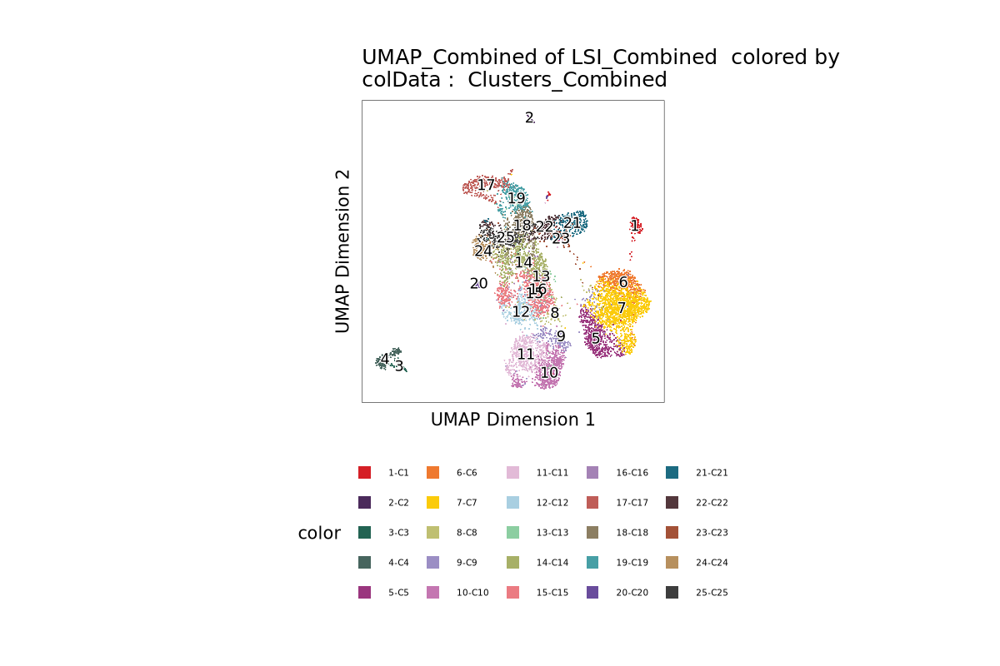

# Mouse Brain Multi-Omics Analysis

## Overview

This project analyzes **single-cell RNA-seq (scRNA-seq)** and **single-cell ATAC-seq (scATAC-seq)** data from mouse brain tissue using the **[ArchR](https://www.archrproject.com/)** framework.

## Tools

- **ArchR**: For large-scale single-cell ATAC-seq analysis and integration with RNA-seq.
- **Snakemake**: (optional, for reproducibility and workflow management)
- **R** and **Bioconductor**: For scripting and analysis.
- **Scanpy**: (used as reference or for RNA-only processing)

## Data

- Organism: *Mus musculus* (Mouse)
- Tissue: Brain
- Modalities: scRNA-seq and scATAC-seq

## Plots 

### UMAP and Cluster Plots

#### Clustering Overview

#### UMAP by Cluster

#### UMAP by Sample

#### nUMI per Cluster

### Marker Genes UMAPs 
- [MARKER GENES UMAP](Rplots.pdf)

### Cell Counts Per Sample

| Sample  | Cell Count |
|---------|------------|
| Control | 3686       |
| KO      | 3757       |

